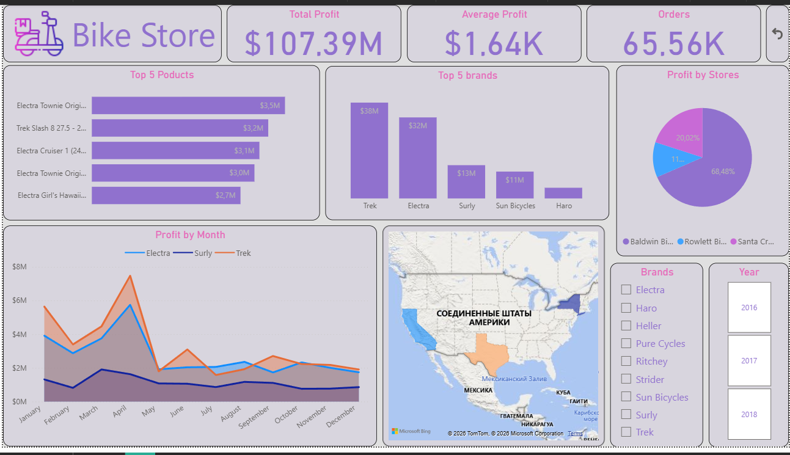

# Bike Sales Analysis (SQL + Power BI)

## Project Overview

In this project I analyzed bicycle sales using SQL and Power BI.

The dataset contains information about:

- orders
- products
- brands
- stores

The goal of the project was to identify key business insights from sales data.

---

## Data Preparation

The dataset consisted of several tables which were joined using SQL.

Tables used:

- orders
- order_items
- products
- brands
- stores

LEFT JOIN was used to combine these tables into one dataset for analysis.

Profit was calculated using:

profit = quantity * list_price * (1 - discount)

---

## Analysis Performed

The following analysis was performed using SQL:

- Top brands by profit
- Top products by profit
- Profit by store
- Profit by state
- Total profit
- Average profit
- Profit per order
- Delivery performance analysis

---

## Dashboard

Below is the Power BI dashboard created from the prepared dataset.

---

## Tools Used

SQL  
Power BI  
Data Analysis  
Data Visualization
